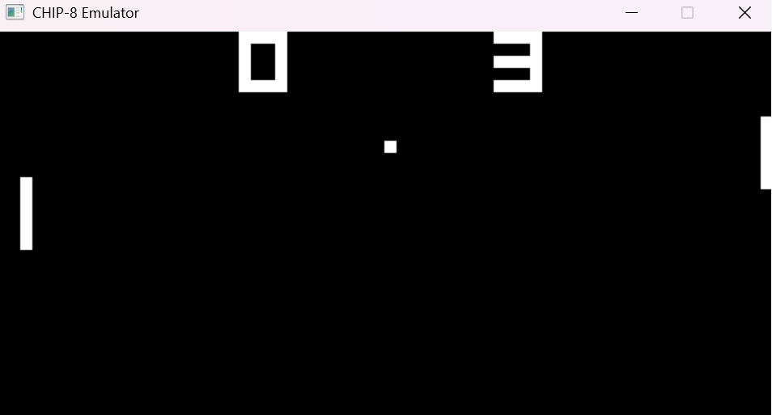
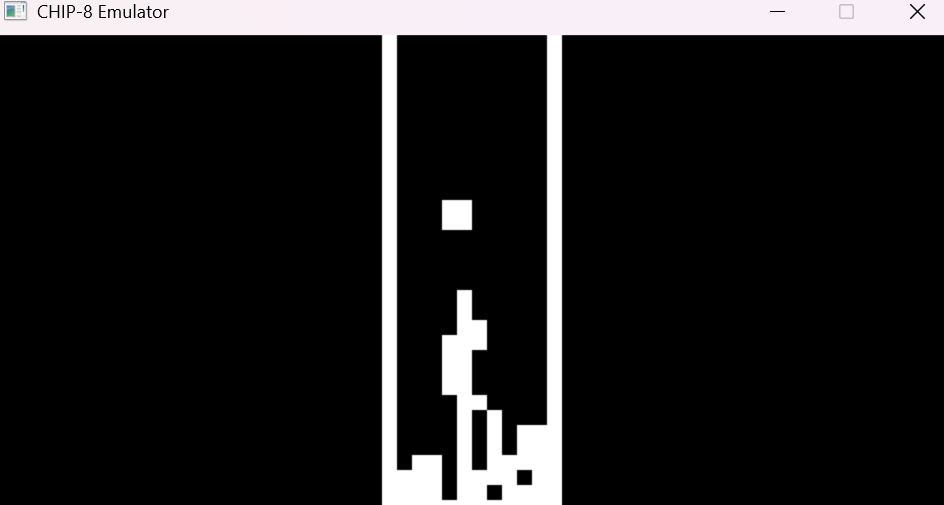

# A CHIP-8 interpreter emulator written in C++, using SDL2 for graphics and input 

### Pong:

### Tetris:


## Controls

CHIP-8 uses a 16-key hex keypad, mapped to the keyboard as follows:

| | | | |
|---|---|---|---|
| 1 | 2 | 3 | 4 |
| Q | W | E | R |
| A | S | D | F |
| Z | X | C | V |

(Maps to hex keys `1 2 3 C / 4 5 6 D / 7 8 9 E / A 0 B F`)

## Building

Requires CMake, a C++17 compiler, and [vcpkg](https://github.com/microsoft/vcpkg) with SDL2 installed:

```bash
vcpkg install sdl2:x64-windows
```

Then:

```bash
cmake -B build -DCMAKE_TOOLCHAIN_FILE=[path to vcpkg]/scripts/buildsystems/vcpkg.cmake
cmake --build build
```

## Usage

```bash
chip8-emulator.exe <scale> <cycle-delay-ms> <rom-path>
```

Example:
```bash
chip8-emulator.exe 10 3 roms/Tetris.ch8
```


## Reference  

http://devernay.free.fr/hacks/chip8/C8TECH10.HTM
